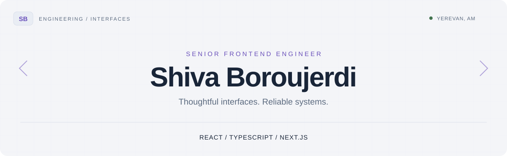

<picture>
  <source media="(prefers-color-scheme: dark)" srcset="assets/profile-dark.svg">
  <source media="(prefers-color-scheme: light)" srcset="assets/profile-light.svg">
  
</picture>

  <a href="https://www.linkedin.com/in/shiva-boroujerdi/"><strong>LinkedIn ↗</strong></a>
  &nbsp; · &nbsp;
  <a href="mailto:shiva.boroujerdi@gmail.com"><strong>Let's talk ↗</strong></a>
  &nbsp; · &nbsp;
  Yerevan, Armenia

 

I turn complex product requirements into interfaces that feel clear and work reliably. My focus is **frontend architecture, real-time experiences, and design systems** — with hands-on product experience connecting user needs to engineering decisions.

<table>
  <tr>
    <td align="center" width="33%"><h2>10+ years</h2>Frontend engineering From responsive websites to complex products</td>
    <td align="center" width="33%"><h2>50+ apps</h2>Delivered at Radcom Responsive, cross-browser web applications</td>
    <td align="center" width="33%"><h2>Up to 5%</h2>Less code at Smartech Reusable components + Redux Toolkit migration</td>
  </tr>
</table>

### 01 / Engineering focus

<table>
  <tr>
    <td width="50%" valign="top">
      <h3>Interfaces that scale</h3>
      Modular frontend architecture, typed API clients, reusable components, and predictable state management.
        
      <code>React</code> <code>TypeScript</code> <code>OpenAPI</code>
    </td>
    <td width="50%" valign="top">
      <h3>Experiences that respond</h3>
      Streaming AI chat, reconnection and abort controls, query caching, and infinite pagination.
        
      <code>SSE</code> <code>TanStack Query</code> <code>RxJS</code>
    </td>
  </tr>
</table>

I care about the details around the interface, too: **accessibility, performance, automated tests, observability, and clear code reviews**.

### 02 / Experience, in brief

| When | Where & what |
| :--- | :--- |
| **2026 — now** | **Tusiro · Technical Product Lead** Discovery, product workflows, and implementation-ready specifications for a financial systems integrity platform. |
| **2025 — 2026** | **Novin Dev · Senior Frontend Developer** Real-time AI chat, typed service layers, protected routes, localization, and observability. |
| **2021 — 2025** | **Smartech · Senior Frontend Developer** Marketing automation, design systems, Redux Toolkit migration, notifications, Cypress tests, and mentorship. |
| **2015 — 2021** | **Radcom · Frontend Developer** Responsive web applications, reusable interfaces, performance, accessibility, and SEO. |

Earlier experience & education

 

- **Ideh Pardazan · Frontend Developer** — June 2014–April 2015. Joomla websites, PSD-to-web implementation, and SEO.
- **Bachelor's degree, Information Technology** — University of Applied Science and Technology, 2015.
- **Associate's degree, Software Engineering** — Sadra University, 2013.

### 03 / Tools I work with

**Build** &nbsp; `React` `Next.js` `TypeScript` `JavaScript` `HTML` `CSS / Sass` 
**State & data** &nbsp; `Redux Toolkit` `TanStack Query` `React Hook Form` `REST` `GraphQL` 
**Interface** &nbsp; `Tailwind CSS` `Material UI` `Ant Design` `Figma` 
**Quality & delivery** &nbsp; `Vitest` `Jest` `Testing Library` `Cypress` `Sentry` `Vite` `Docker` `CI`

### 04 / Engineering notes

**[Architecture decision records ↗](https://github.com/Shiva-Br/architecture-decision-records)** 
Frontend decisions covering architecture, API fetching, routing, state management, build tooling, and team conventions.

---

<strong>Let's build something thoughtful.</strong>

Interested in Senior / Lead Frontend and Frontend Platform roles.

  <a href="mailto:shiva.boroujerdi@gmail.com">shiva.boroujerdi@gmail.com</a> 
  +37455867301 
  <a href="https://www.linkedin.com/in/shiva-boroujerdi/">LinkedIn</a>

